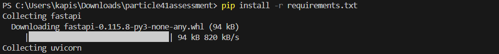

# particle41assessment


# Task1 - Tiny App Development 'SimpleTimeService'

A lightweight microservice that returns the current timestamp and the client's IP address.

## Features

- Built with FastAPI
- Dockerized for easy deployment
- Runs as a non-root user for security
- Lightweight and minimal dependencies

## Prerequisites

Ensure you have the following installed:

- Python 
- Docker

## API Endpoint

### **GET /**

Returns the current timestamp and the client's IP address.

#### **Example Response:**

```json
{
  "timestamp": "2025-01-31T12:00:00.000Z",
  "ip": "192.168.1.1"
}
```

## Implementation & Running Locally
   1. Python application (app.py)
   2. Dockerfile to containerize
   3. requirements.txt file

### **Running locally**

1. Install dependencies:
   ```sh
   pip install -r requirements.txt
   ```
   
   

4. Start the server:
   ```sh
   uvicorn app:app --host 0.0.0.0 --port 8000
   ```
5. Access the API at:
   ```
   http://127.0.0.1:8000/
   ```

## Running with Docker

### **Build and Run the Container**

1. Build the Docker image:
   ```sh
   docker build -t simple-time-service .
   ```
2. Run the container:
   ```sh
   docker run -p 8000:8000 simple-time-service
   ```
3. Access the API at:
   ```
   http://127.0.0.1:8000/
   ```


## Deploying to Docker Hub

### **Push Image to Docker Hub**

1. Log in to Docker Hub:
   ```sh
   docker login
   ```
2. Tag the Docker image:
   ```sh
   docker tag simple-time-service <your-dockerhub-username>/simple-time-service:latest
   ```
3. Push the image:
   ```sh
   docker push <your-dockerhub-username>/simple-time-service:latest
   ```
   

   DockerHub ss

   
   
5. Pull and run the image anywhere using:
   ```sh
   docker run -p 8000:8000 <your-dockerhub-username>/simple-time-service:latest
   ```


## License

This 

